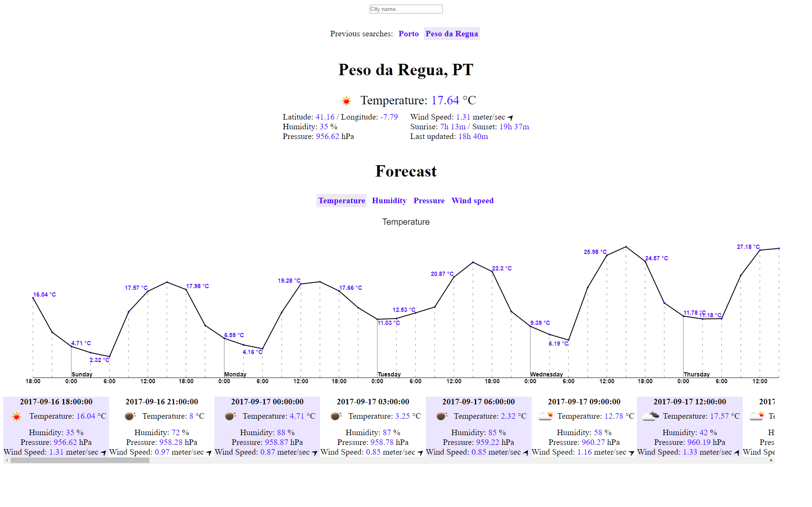

# Weather Application #

Search for a city to get some weather information on it. It shows the current weather information, and the forecast of the next 5 days.
It keeps track of previous city name searches (so you can easily check it out again).

Uses the data from [openweathermap.org/](https://openweathermap.org/), and is written with [typescript](https://www.typescriptlang.org/) and [react](https://facebook.github.io/react/).

## [Try it out here!](https://nbpt.eu/app/weather) ##

# Development #

- `npm install` : Install the necessary dependencies.
- `npm run start` : Start the compiler in watch mode, and run a local server at `http://localhost:8000`.
- `npm run build` : Run the release build (the final result will be located in the `./release/` directory).